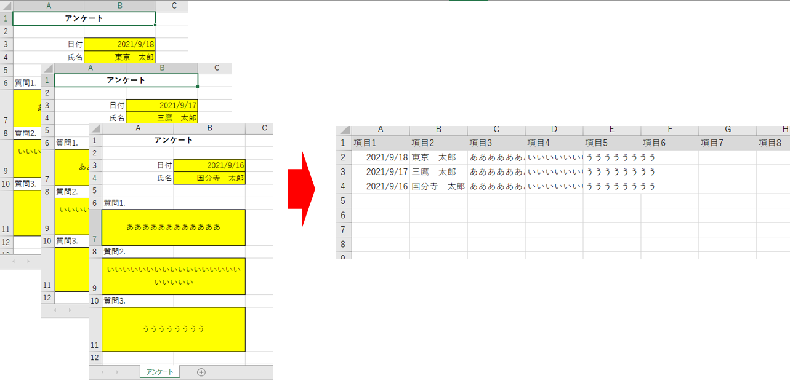

# フォルダ内にある複数のエクセル単票をひとつにまとめるツール（ExcelVBA）

**目次**
 1. [動作検証環境](#1)
 2. [機能仕様](#2)
 3. [入手方法](#3)
 4. [使い方](#4)
 5. [更新履歴](#5)

 

##  1. 動作検証環境

|対象OS|必要ソフト|備考|
|--|--|--|
|Windows10|Excel2019、Outlook2019|旧バージョンのOfficeでも動作可

##  2. 機能仕様

|機能|説明|備考|
|--|--|--|
|エクセルマージ|フォルダ内に置かれた複数のエクセル単票をひとつのエクセルにまとめる処理|拡張子が「xlsx」「xls」のファイルのみを処理

##  3. 入手方法

1. ツール本体「フォルダ内にある複数のエクセル単票をひとつにまとめるツール.xlsm」をダウンロード

##  4. 使い方

1. このツールがあるフォルダと同じフォルダ内に、マージするエクセルファイルを格納 ※フォルダ内に置かれた全てのファイルをマージします

1. マージするエクセルファイルのコピーしたいセル位置を、ツールの「設定」シートに入力

1. マージするエクセルファイルのシート番号を入力 ※シートがひとつだけの場合は1を入力してください

1. 「集計開始」ボタンを押すと、「集計シート」にマージ結果が表示されます

##  5. エラーになる場合
「Dim fs As FileSystemObject」エラーメッセージが出る場合、「ツール」タブ→「参照設定」→Microsoft Scripting Runtimeのライブラリにチェックを入れる

##  5. 更新履歴
|バージョン|更新日|更新内容|更新者|
|--|--|--|--|
|1.0.0.0|2022/02/23|新規作成|kannuki@tokyo|
